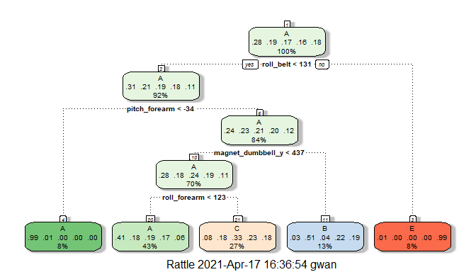

## Overview
Data from accelerometers on the belt, forearm, arm and dumbell of 6 participants will be used to predict the manner in which they did the exercise.  The "classe" variable will be used to determine this.  The participants were asked to perform barbell lifts correctly and incorrectly in 5 different ways.

More information is available in the section on the Weight Lifting Exercise Dataset from the link:
http://web.archive.org/web/20161224072740/http:/groupware.les.inf.puc-rio.br/har

We will build a model from the Training set and use the validation set to predict "classe".  The prediction methods that will be used are **Decision Trees, Gradient Boosting and Random Forest**.  The accuracy and out of Sample Error will be calculated and compared for each model.

The prediction model with the best accuracy and hence lowest error will be used to predict "classe" values for the testing set of 20 observations provided in the link.

## Loading the training data

```r
url <- "C:/Users/gwan/Desktop/pml-training.csv"
training = read.csv(url)

## get the columns/rows available
dim(training)
```

```
## [1] 19622   160
```

```r
## Sample Structure of the dataset
str(training[,1:10])
```

```
## 'data.frame':	19622 obs. of  10 variables:
##  $ X                   : int  1 2 3 4 5 6 7 8 9 10 ...
##  $ user_name           : chr  "carlitos" "carlitos" "carlitos" "carlitos" ...
##  $ raw_timestamp_part_1: int  1323084231 1323084231 1323084231 1323084232 1323084232 1323084232 1323084232 1323084232 1323084232 1323084232 ...
##  $ raw_timestamp_part_2: int  788290 808298 820366 120339 196328 304277 368296 440390 484323 484434 ...
##  $ cvtd_timestamp      : chr  "05/12/2011 11:23" "05/12/2011 11:23" "05/12/2011 11:23" "05/12/2011 11:23" ...
##  $ new_window          : chr  "no" "no" "no" "no" ...
##  $ num_window          : int  11 11 11 12 12 12 12 12 12 12 ...
##  $ roll_belt           : num  1.41 1.41 1.42 1.48 1.48 1.45 1.42 1.42 1.43 1.45 ...
##  $ pitch_belt          : num  8.07 8.07 8.07 8.05 8.07 8.06 8.09 8.13 8.16 8.17 ...
##  $ yaw_belt            : num  -94.4 -94.4 -94.4 -94.4 -94.4 -94.4 -94.4 -94.4 -94.4 -94.4 ...
```

## Loading the testing data

```r
url <- "C:/Users/gwan/Desktop/pml-testing.csv"
testingfinal = read.csv(url)

## get the rows/columns available
dim(testingfinal)
```

```
## [1]  20 160
```

```r
## Sample Structure of the dataset
str(testingfinal[,1:10])
```

```
## 'data.frame':	20 obs. of  10 variables:
##  $ X                   : int  1 2 3 4 5 6 7 8 9 10 ...
##  $ user_name           : chr  "pedro" "jeremy" "jeremy" "adelmo" ...
##  $ raw_timestamp_part_1: int  1323095002 1322673067 1322673075 1322832789 1322489635 1322673149 1322673128 1322673076 1323084240 1322837822 ...
##  $ raw_timestamp_part_2: int  868349 778725 342967 560311 814776 510661 766645 54671 916313 384285 ...
##  $ cvtd_timestamp      : chr  "05/12/2011 14:23" "30/11/2011 17:11" "30/11/2011 17:11" "02/12/2011 13:33" ...
##  $ new_window          : chr  "no" "no" "no" "no" ...
##  $ num_window          : int  74 431 439 194 235 504 485 440 323 664 ...
##  $ roll_belt           : num  123 1.02 0.87 125 1.35 -5.92 1.2 0.43 0.93 114 ...
##  $ pitch_belt          : num  27 4.87 1.82 -41.6 3.33 1.59 4.44 4.15 6.72 22.4 ...
##  $ yaw_belt            : num  -4.75 -88.9 -88.5 162 -88.6 -87.7 -87.3 -88.5 -93.7 -13.1 ...
```
This finaltesting dataset will be used for out final prediction of "classe".

## Loading the packages 

```r
library(ggplot2)
library(lattice)
library(caret)
```

```
## Warning: package 'caret' was built under R version 4.0.4
```

```r
library(randomForest)
```

```
## Warning: package 'randomForest' was built under R version 4.0.5
```

```
## randomForest 4.6-14
```

```
## Type rfNews() to see new features/changes/bug fixes.
```

```
## 
## Attaching package: 'randomForest'
```

```
## The following object is masked from 'package:ggplot2':
## 
##     margin
```

```r
library(rattle)
```

```
## Warning: package 'rattle' was built under R version 4.0.5
```

```
## Loading required package: tibble
```

```
## Loading required package: bitops
```

```
## Rattle: A free graphical interface for data science with R.
## Version 5.4.0 Copyright (c) 2006-2020 Togaware Pty Ltd.
## Type 'rattle()' to shake, rattle, and roll your data.
```

```
## 
## Attaching package: 'rattle'
```

```
## The following object is masked from 'package:randomForest':
## 
##     importance
```

```r
## set the seed data
set.seed(300)
```

## Cleaning data

```r
## Remove the first 7 columns which are not relevant to the study
training <- training[,-c(1:7)]

## Remove variables that have little variability
nvz <- nearZeroVar(training)
training <- training[,-nvz]

## Remove variables with NAS
training <- training[,colSums(is.na(training))==0]

dim(training)
```

```
## [1] 19622    53
```
The training dataset have now 53 columns


## Splitting the training set
The training set is divided in two parts one for training and the other for cross validation.
70% is used as training set and 30% as the validation set.


```r
trainInd <- createDataPartition(y=training$classe, p=0.7, list=FALSE)
train <- training[trainInd,]
test  <- training[-trainInd,]
dim(train)
```

```
## [1] 13737    53
```

```r
dim(test)
```

```
## [1] 5885   53
```

```r
## create a train control variable with sample method of cross validation and number of folds = 3
control <- trainControl(method="cv", number=3, verboseIter=FALSE)
```

# Building and Testing the Models

## 1. Decision Tree

```r
fitdt <- train(classe ~ .,data=train,method="rpart")
preddt <- predict(fitdt,test)

# need to covert to factor as test$classe is chr
cfm <- confusionMatrix(preddt, as.factor(test$classe))

cfm
```

```
## Confusion Matrix and Statistics
## 
##           Reference
## Prediction    A    B    C    D    E
##          A 1528  480  478  434  147
##          B   32  375   35  176  143
##          C  110  284  513  354  307
##          D    0    0    0    0    0
##          E    4    0    0    0  485
## 
## Overall Statistics
##                                           
##                Accuracy : 0.4929          
##                  95% CI : (0.4801, 0.5058)
##     No Information Rate : 0.2845          
##     P-Value [Acc > NIR] : < 2.2e-16       
##                                           
##                   Kappa : 0.3372          
##                                           
##  Mcnemar's Test P-Value : NA              
## 
## Statistics by Class:
## 
##                      Class: A Class: B Class: C Class: D Class: E
## Sensitivity            0.9128  0.32924  0.50000   0.0000  0.44824
## Specificity            0.6345  0.91867  0.78288   1.0000  0.99917
## Pos Pred Value         0.4982  0.49277  0.32717      NaN  0.99182
## Neg Pred Value         0.9482  0.85090  0.88117   0.8362  0.88936
## Prevalence             0.2845  0.19354  0.17434   0.1638  0.18386
## Detection Rate         0.2596  0.06372  0.08717   0.0000  0.08241
## Detection Prevalence   0.5212  0.12931  0.26644   0.0000  0.08309
## Balanced Accuracy      0.7737  0.62395  0.64144   0.5000  0.72371
```

```r
fancyRpartPlot(fitdt$finalModel)
```

<!-- -->

## 2. Gradient Boosting 

```r
fitbt <- train(classe ~ ., method="gbm", data=train, trControl=control, tuneLength = 5,verbose=FALSE)
predbt <- predict(fitbt,test)
# need to convert to factor as test$classe is chr
cfm <- confusionMatrix(predbt, as.factor(test$classe))
cfm
```

```
## Confusion Matrix and Statistics
## 
##           Reference
## Prediction    A    B    C    D    E
##          A 1669    4    0    0    1
##          B    5 1125    6    2    3
##          C    0   10 1012   12    5
##          D    0    0    8  949    6
##          E    0    0    0    1 1067
## 
## Overall Statistics
##                                           
##                Accuracy : 0.9893          
##                  95% CI : (0.9863, 0.9918)
##     No Information Rate : 0.2845          
##     P-Value [Acc > NIR] : < 2.2e-16       
##                                           
##                   Kappa : 0.9865          
##                                           
##  Mcnemar's Test P-Value : NA              
## 
## Statistics by Class:
## 
##                      Class: A Class: B Class: C Class: D Class: E
## Sensitivity            0.9970   0.9877   0.9864   0.9844   0.9861
## Specificity            0.9988   0.9966   0.9944   0.9972   0.9998
## Pos Pred Value         0.9970   0.9860   0.9740   0.9855   0.9991
## Neg Pred Value         0.9988   0.9970   0.9971   0.9970   0.9969
## Prevalence             0.2845   0.1935   0.1743   0.1638   0.1839
## Detection Rate         0.2836   0.1912   0.1720   0.1613   0.1813
## Detection Prevalence   0.2845   0.1939   0.1766   0.1636   0.1815
## Balanced Accuracy      0.9979   0.9922   0.9904   0.9908   0.9930
```

```r
#plot(fitbt)
```


## 3. Random Forest

```r
fitrf <- train(classe~ .,data=train, method="rf", trControl=control, tuneLength = 5)
predrf <- predict(fitrf,test)
# need to covert to factor as test$classe is chr
cfm <- confusionMatrix(predrf, as.factor(test$classe))
cfm
```

```
## Confusion Matrix and Statistics
## 
##           Reference
## Prediction    A    B    C    D    E
##          A 1672    2    0    0    0
##          B    1 1135    2    0    0
##          C    0    2 1021    7    1
##          D    0    0    3  957    2
##          E    1    0    0    0 1079
## 
## Overall Statistics
##                                           
##                Accuracy : 0.9964          
##                  95% CI : (0.9946, 0.9978)
##     No Information Rate : 0.2845          
##     P-Value [Acc > NIR] : < 2.2e-16       
##                                           
##                   Kappa : 0.9955          
##                                           
##  Mcnemar's Test P-Value : NA              
## 
## Statistics by Class:
## 
##                      Class: A Class: B Class: C Class: D Class: E
## Sensitivity            0.9988   0.9965   0.9951   0.9927   0.9972
## Specificity            0.9995   0.9994   0.9979   0.9990   0.9998
## Pos Pred Value         0.9988   0.9974   0.9903   0.9948   0.9991
## Neg Pred Value         0.9995   0.9992   0.9990   0.9986   0.9994
## Prevalence             0.2845   0.1935   0.1743   0.1638   0.1839
## Detection Rate         0.2841   0.1929   0.1735   0.1626   0.1833
## Detection Prevalence   0.2845   0.1934   0.1752   0.1635   0.1835
## Balanced Accuracy      0.9992   0.9979   0.9965   0.9959   0.9985
```

```r
plot(fitrf,main="Figure 1: Random Forest : Mean Decrease Accuracy ")
```

<!-- -->


```r
v <- randomForest(formula = as.factor(classe) ~ . , data = train, ntree=100,mtry=2, importance = TRUE)
varImpPlot(v, main = "Figure 2: Random Forest : Measurement of variable Importance")
```

<!-- -->

```r
plot(v,main="Figure 3: Random Forest : Error rate v/s No of Trees")
```

<!-- -->

- Figure 1: The model accuracy plot shows that maximum accuracy is achieved between 10-20 predictors.
- Figure 2: The Mean Decrease Accuracy plot shows that "roll_belt" is the most important variable.
- Figure 3: The Error Rate decreases as the number of trees increases.

## Comparing the Models
- The accuracy for Decision Tree is 0.4929 and Out of Sample Error is 0.5071
- The accuracy for Gradient Boosting is 0.9893 and Out of Sample Error is 0.0107
- The accuracy for Random Forest is 0.9964 and Out of Sample Error is 0.0036
- As the Random Forest has the best accuracy and lowest Out of Sample error among the model fits, we will apply this model of prediction on the Testing set.

## Prediction on Final Testing data using best model 

```r
pred <- predict(fitrf,newdata=testingfinal)
pred
```

```
##  [1] B A B A A E D B A A B C B A E E A B B B
## Levels: A B C D E
```
The above predictions will be used for the project quiz.
